# Let's Go, Pikachu/Eevee!
In mainland China, the <a href="https://www.nppa.gov.cn/" rel="noopener noreferrer">National Press and Publication Administration</a> (国家新闻出版署) approves all video games for release, regardless of whether it was developed domestically or internationally.
Almost six years after its original release, <i>Pokémon: Let's Go, Eevee!</i> was <a href="https://www.nppa.gov.cn/bsfw/jggs/yxspjg/jkwlyxspxx/202402/t20240202_831561.html" rel="noopener noreferrer">approved for release</a> on April 7, <i>Pokémon: Let's Go, Pikachu!</i> was approved for release on June 5, and both games were released for the Nintendo Switch on September 26, 2024. This makes it the second Pokémon game release on the Nintendo Switch in mainland China, after [New Pokémon Snap](../NPS/README.md).

The following changes are present between the Simplified Chinese language option released internationally and the mainland Chinese release.
Note that while we can see that these changes are present, we can't necessarily tell *who* was behind the change:
some of these changes may have been pre-emptive self-censorship by Nintendo, iQue, or Tencent rather than censored by the Chinese government per se.

## Game title and logo
<table>
<tr>
<th>Context</th>
<th>China</th>
<th>International</th>
</tr>
<tr>
<td>Let's Go, Pikachu! logo</td>
<td lang="zh-cmn-Hans">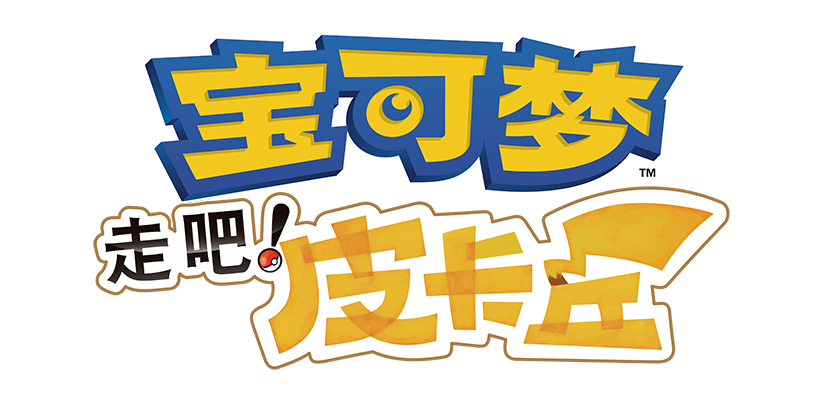 "宝可梦 走吧！皮卡丘"</td>
<td lang="zh-cmn-Hans">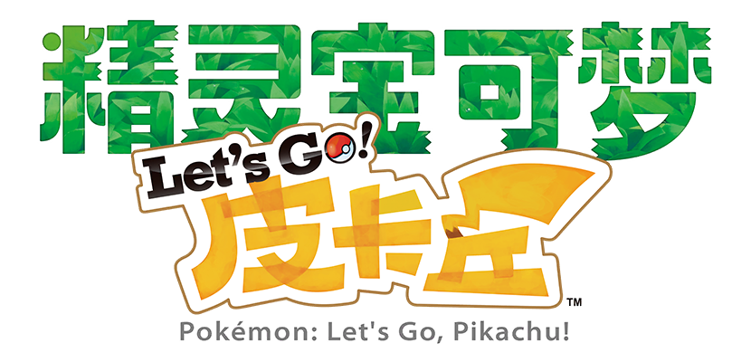 "精灵宝可梦 Let's Go! 皮卡丘"</td>
</tr>
<tr>
<td>Let's Go, Eevee! logo</td>
<td lang="zh-cmn-Hans">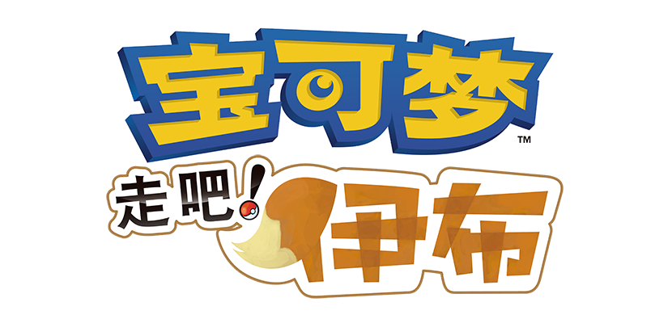 "宝可梦 走吧！皮卡丘"</td>
<td lang="zh-cmn-Hans">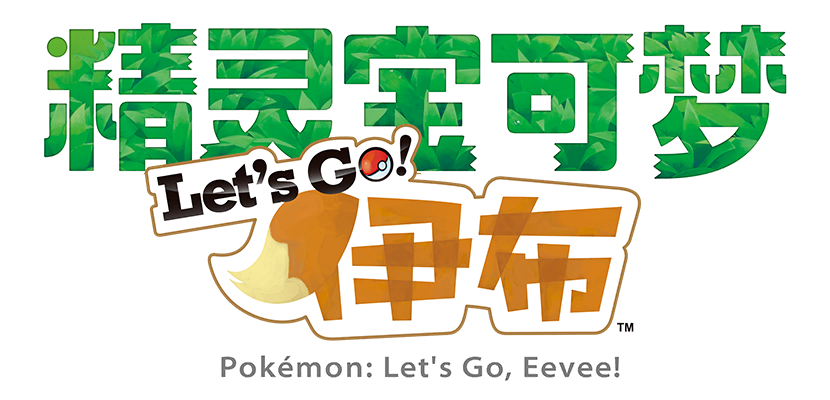 "精灵宝可梦 Let's Go! 伊布"</td>
</tr>
</table>

Initially, the Chinese games used 精灵宝可梦 <i>Jīnglíng Bǎokěmèng</i> as a translation of "Pocket Monsters", and 宝可梦 <i>Bǎokěmèng</i> as a translation of "Pokémon". Since Pokémon Sword/Shield, they've both been translated as 宝可梦, like how both terms are translated as "Pokémon" in English. They've also switched to using an international-style blue-and-yellow logo, rather than trying to follow the Japanese design with the original green logo. These changes are carried back to these games to reflect current usage.

Games with English words, especially those code-mixed with Chinese, often don't get approval. This notably affects the words "Let's Go!" in the title of the game, which were swapped for an equivalent Chinese phrase in 走吧！ <i>Zǒu Ba!</i>. This also affects Professor Oak's "world of Pokémon" intro, since he originally said "Let's go!" in English words in the international version.

The English subtitle was likely originally present only for the Hong Kong market, since there's been some controversy over how the Mandarin names don't sound as close to the original in Cantonese. There was no reason to keep this for the Mainland Chinese market, so it's been removed.

<table>
<tr>
<th>Context</th>
<th>China</th>
<th>International</th>
</tr>
<tr>
<td>Title sequence</td>
<td lang="zh-cmn-Hans"> "游戏狂想家 出品"</td>
<td> "PRESENTED BY GAME FREAK"</td>
</tr>
</table>

In the international versions, the name of GAME FREAK is kept in English in all languages.
In the mainland Chinese version, the company's name is translated into Chinese.

## Language select
<table>
<tr>
<th>China</th>
<th>International</th>
</tr>
<tr>
<td>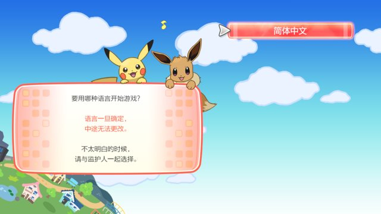</td>
<td>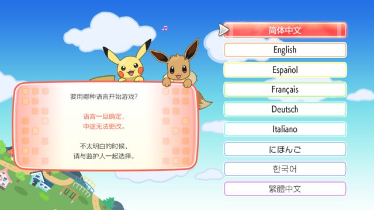</td>
</tr>
</table>

In the mainland Chinese versions, all of the other language options besides Simplified Chinese (简体中文) are removed.
They are still in the game data though, and will still display properly if the save file is edited to specify a different language.

For comparison, in New Pokémon Snap, they actually skipped the equivalent screen, but whoever was working on this localization probably though it was easier to just delete the other options from this menu instead.

## Pokémon GO
<table>
<tr>
<th>China</th>
<th>International</th>
</tr>
<tr>
<td>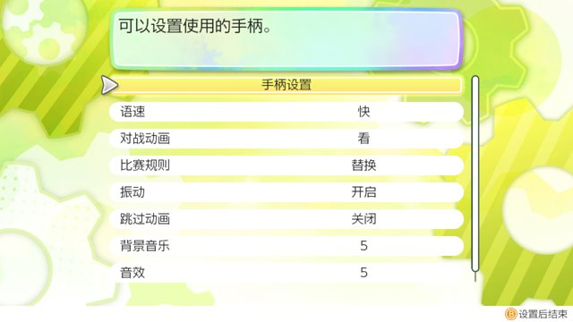</td>
<td>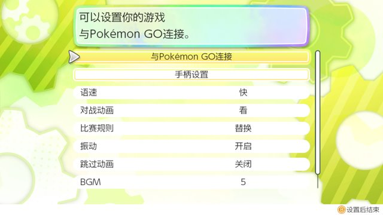</td>
</tr>
<tr>
<td>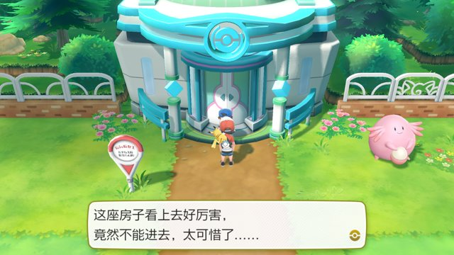</td>
<td></td>
</tr>
</table>
<table>
<tr>
<th>Context</th>
<th>Simplified Chinese</th>
<th>Japanese</th>
<th>English/Translation</th>
</tr>
<tr>
<td>Sign (International)</td>
<td lang="zh-cmn-Hans">
前方是GO Park。 
著名游戏项目—— 
宝可梦领航家！</td>
<td lang="ja">
この先　ＧＯパーク 
名物　ゲーム！ 
……導いて　ポケモン！</td>
<td>
GO Park complex ahead! 
Pokémon Chase: 
It’s the Famous Herding Game Everyone Loves!</td>
</tr>
<tr>
<td>Sign (China)</td>
<td lang="zh-cmn-Hans">前方禁止入内</td>
<td><i>N/A</i></td>
<td>No Trespassing</td>
</tr>
<tr>
<td>Youngster (China)</td>
<td lang="zh-cmn-Hans">
这座房子看上去好厉害， 
竟然不能进去，太可惜了…… 
还是在互动区 
跟宝可梦们玩会儿吧。</td>
<td lang="ja">
すごそうな　たてもの 
はいれなくて　ざんねん…… 
ふれあいエリアで 
ポケモンたちと　あそぼうかな</td>
<td>
This building looks awesome, 
but it's a shame we can't go inside... 
I might play with the Pokémon 
in the Playful Park instead.</td>
</tr>
</table>

In the mainland Chinese versions, the ability to transfer Pokémon from Pokémon GO is removed. This was done by removing the "Open Pokémon GO Settings" option in the Options menu, and blocking the entrance to the GO Park complex with a Youngster.

Other NPCs that refer to GO Park have their dialogue edited so as not to mention it, typically either by removing the offending sentence or by making the sentence refer to Fuchsia City in general instead.

Meltan and Melmetal can still be obtained by trading them over from the international version, though the Meltan and Melmetal Master Trainers have been removed.

<table>
<tr>
<th>Context</th>
<th>China</th>
<th>International</th>
</tr>
<tr>
<td>GO Park: NEW</td>
<td lang="zh-cmn-Hans"> "新"</td>
<td> "NEW"</td>
</tr>
</table>

The "NEW" graphic is changed to be in Chinese, though I don't believe it ends up being used.

## Location names
The location name "GO Park complex" (GO Park), as well as all event Pokémon met locations except "Poké Ball Plus" (such as "a lovely place", "a Pokémon Center", "a Pokémon movie", etc.), are changed to "faraway place" (遥远的地方).
This can be seen on the summary screen if a Pokémon with one of these met locations is traded locally from the international version.
Many of these reference events, locations, or games not released in mainland China, so they're all just censored to prevent their names from possibly showing up in-game.

## Move animations
A total of 61 moves had their animations changed. While I haven't checked all of them, I've taken screenshots of the following nine moves in both the mainland Chinese version and the international version for your viewing pleasure.

<table>
<tr>
<th>Move</th>
<th>China</th>
<th>International</th>
</tr>
<tr>
<td>Brick Break</td>
<td>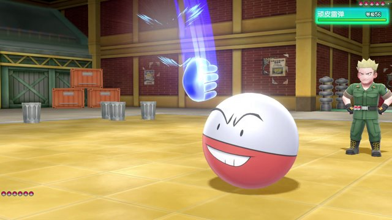</td>
<td>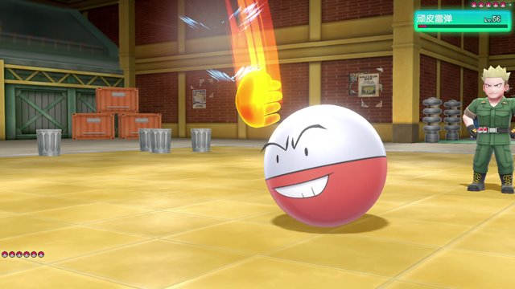</td>
</tr>
<tr>
<td>Metronome</td>
<td>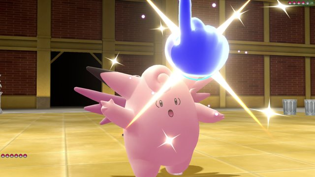</td>
<td>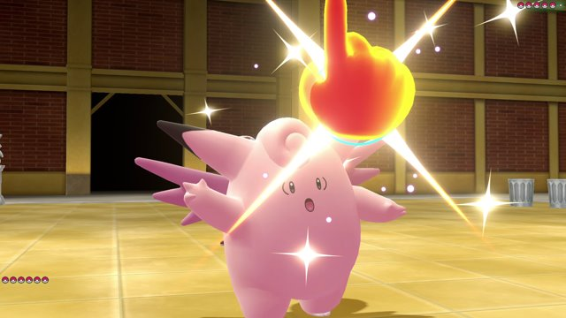</td>
</tr>
<tr>
<td>Jump Kick</td>
<td>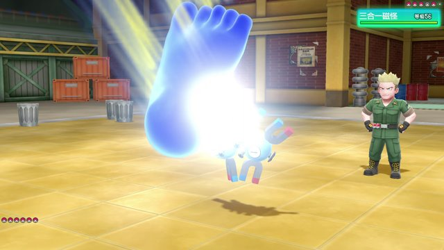</td>
<td>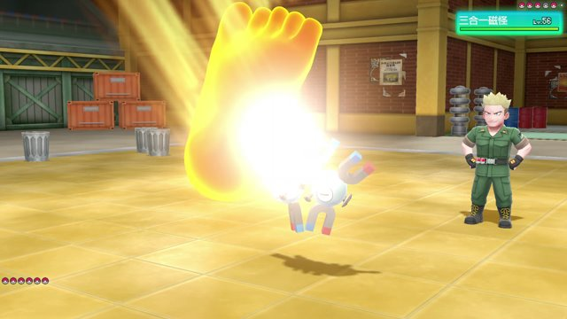</td>
</tr>
</table>

These three moves are the only ones to have had their models changed.
The color of these hands and feet were changed from red to blue.
This is likely because the color red is associated with blood and violence,
so changing the colors to blue might help tone it down.

<table>
<tr>
<th>Move</th>
<th>China</th>
<th>International</th>
</tr>
<tr>
<td>Flamethrower</td>
<td>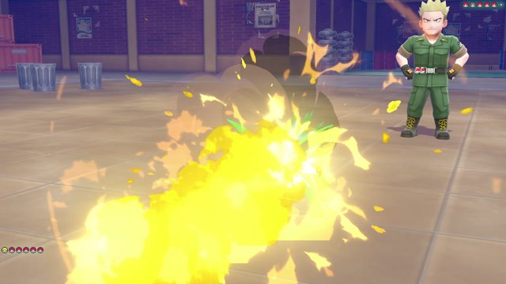</td>
<td>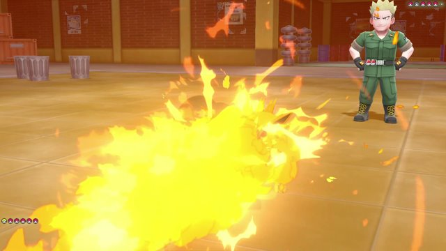</td>
</tr>
<tr>
<td>Heat Wave</td>
<td>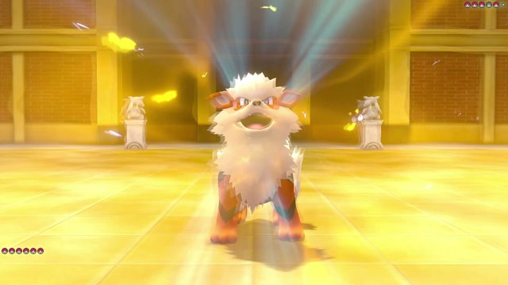
 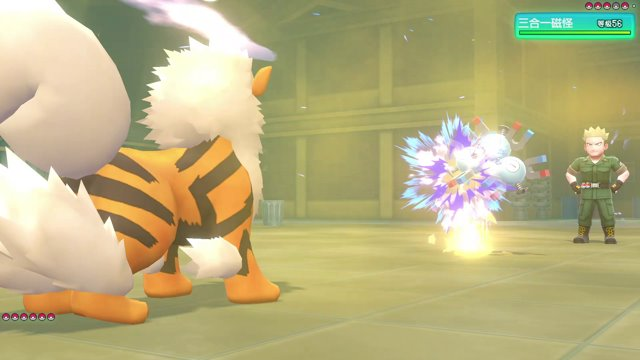</td>
<td>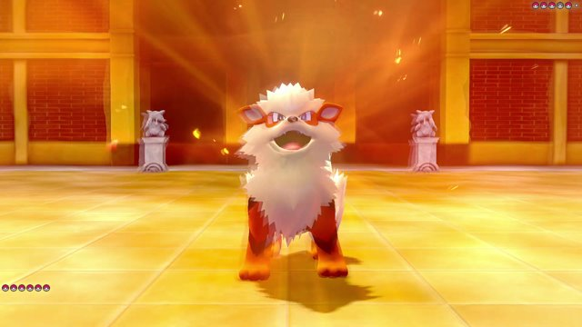
 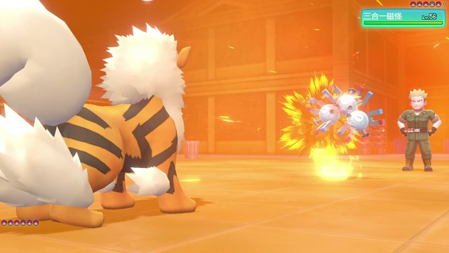</td>
</tr>
<tr>
<td>Self-Destruct</td>
<td></td>
<td></td>
</tr>
</table>

These moves all involve fire or explosions.
Like the last set of moves, orange elements such as the background were changed to blue,
though the fire itself in Flamethrower still retains its orange color.

<table>
<tr>
<th>Move</th>
<th>China</th>
<th>International</th>
<tr>
<td>Scald</td>
<td>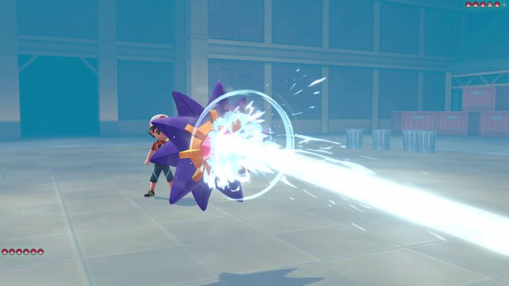</td>
<td>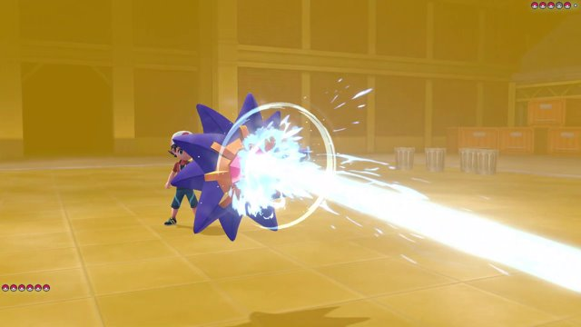</td>
</tr>
<tr>
<td>Thunder</td>
<td>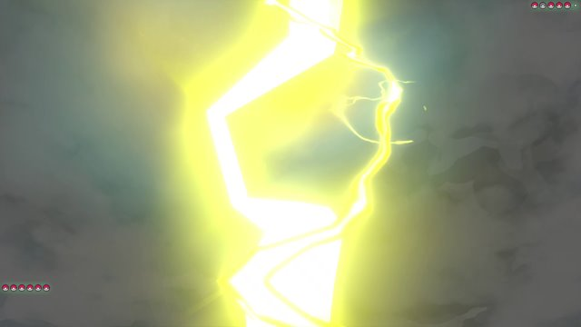</td>
<td>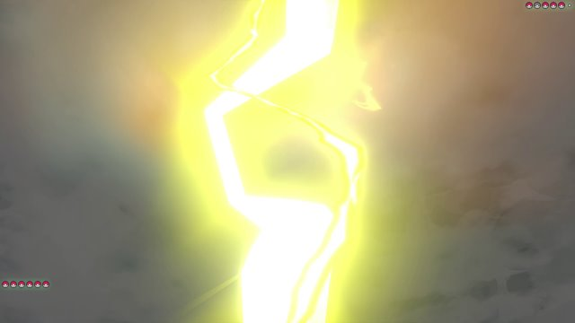</td>
</tr>
<tr>
<td>Psybeam</td>
<td>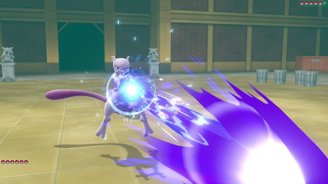</td>
<td>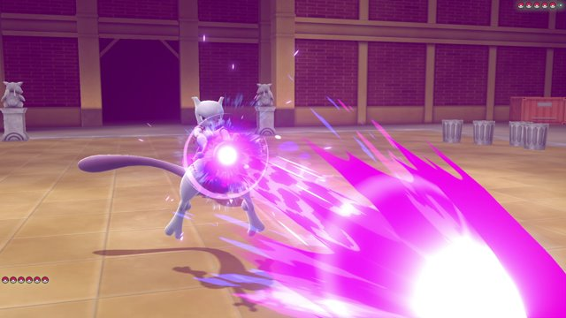</td>
</tr>
</table>

Even though these three moves aren't Fire-type moves, they still have warm-colored elements that are changed to a cool colorscheme.

Here's the full list of moves which had their files modified:
<table>
<tr>
<td>
Pound (拍击) 
Comet Punch (连续拳) 
Mega Punch (百万吨重拳) 
Fire Punch (火焰拳) 
Stomp (踩踏) 
Double Kick (二连踢) 
Mega Kick (百万吨重踢) 
Jump Kick (飞踢) 
Rolling Kick (回旋踢) 
Horn Drill (角钻) 
Thrash (大闹一番) 
Double-Edge (舍身冲撞) 
Bite (咬住) 
Supersonic (超音波) 
Acid (溶解液) 
Flamethrower (喷射火焰) 
Psybeam (幻象光线) 
Hyper Beam (破坏光线) 
Low Kick (踢倒) 
Counter (双倍奉还) 
Strength (怪力)
</td>
<td>
Stun Spore (麻痹粉) 
Fire Spin (火焰旋涡) 
Thunder (打雷) 
Earthquake (地震) 
Quick Attack (电光一闪) 
Rage (愤怒) 
Focus Energy (聚气) 
Metronome (挥指) 
Self-Destruct (玉石俱碎) 
Egg Bomb (炸蛋) 
Fire Blast (大字爆炎) 
Clamp (贝壳夹击) 
Skull Bash (火箭头锤) 
Spike Cannon (尖刺加农炮) 
Glare (大蛇瞪眼) 
Barrage (投球) 
Dizzy Punch (迷昏拳) 
Explosion (大爆炸) 
Hyper Fang (终结门牙) 
Tri Attack (三重攻击) 
Super Fang (愤怒门牙)
</td>
<td>
Struggle (挣扎) 
Outrage (逆鳞) 
Megahorn (超级角击) 
Crunch (咬碎) 
Mirror Coat (镜面反射) 
Shadow Ball (暗影球) 
Fake Out (击掌奇袭) 
Heat Wave (热风) 
Helping Hand (帮助) 
Superpower (蛮力) 
Brick Break (劈瓦) 
Bulk Up (健美) 
Sucker Punch (突袭) 
Flare Blitz (闪焰冲锋) 
Poison Jab (毒击) 
Power Whip (强力鞭打) 
Scald (热水) 
Drill Run (直冲钻) 
Double Iron Bash (钢拳双击) 
&nbsp; 
&nbsp;
</td>
</tr>
</table>

## Town Map
These following screenshots used in the Town Map were all modified. See if you can spot the difference.

<table>
<tr>
<th>Context</th>
<th>China</th>
<th>International</th>
</tr>
<tr>
<td>Route 2</td>
<td lang="zh-cmn-Hans">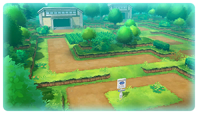</td>
<td>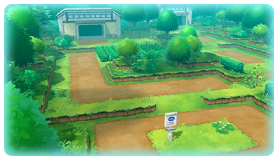</td>
</tr>
<tr>
<td>Route 8</td>
<td lang="zh-cmn-Hans">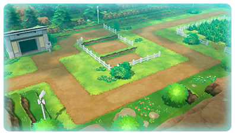</td>
<td>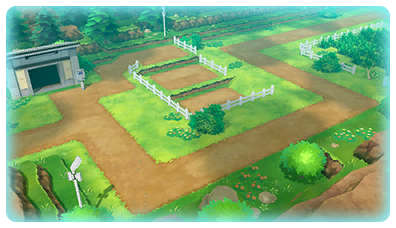</td>
</tr>
<tr>
<td>Route 10</td>
<td lang="zh-cmn-Hans">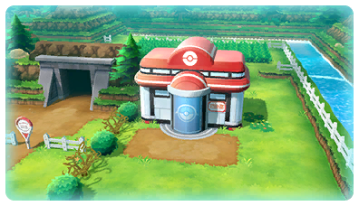</td>
<td>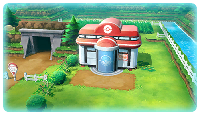</td>
</tr>
<tr>
<td>Route 12</td>
<td lang="zh-cmn-Hans">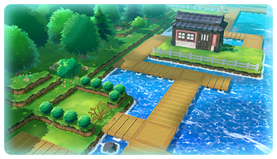</td>
<td>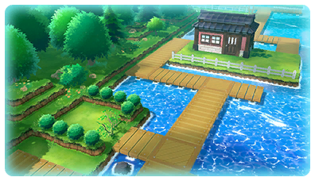</td>
</tr>
<tr>
<td>Route 13</td>
<td lang="zh-cmn-Hans">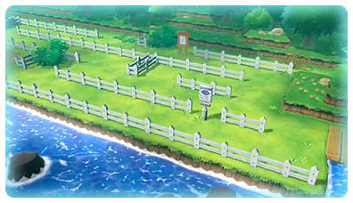</td>
<td>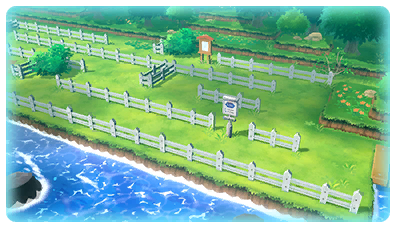</td>
</tr>
<tr>
<td>Route 14</td>
<td lang="zh-cmn-Hans">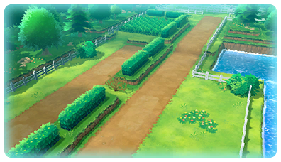</td>
<td>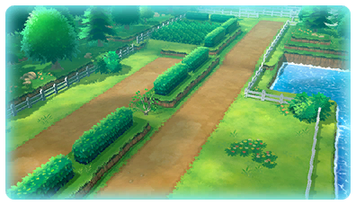</td>
</tr>
<tr>
<td>Route 25</td>
<td lang="zh-cmn-Hans">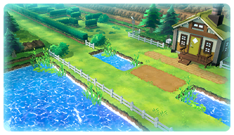</td>
<td>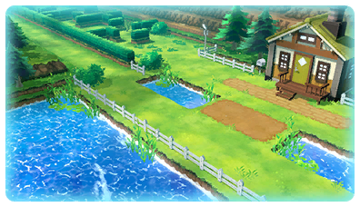</td>
</tr>
<tr>
<td>Cerulean City</td>
<td lang="zh-cmn-Hans">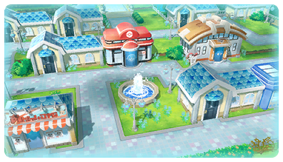</td>
<td>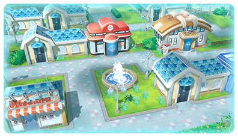</td>
</tr>
<tr>
<td>Vermilion City</td>
<td lang="zh-cmn-Hans">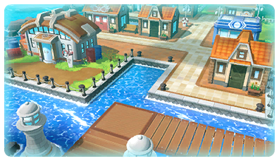</td>
<td>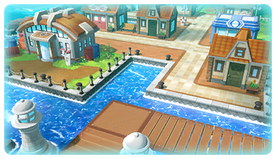</td>
</tr>
</table>

Did you notice what they all have in common?

<table>
<tr>
<th>China</th>
<th>International</th>
</tr>
<tr>
<td>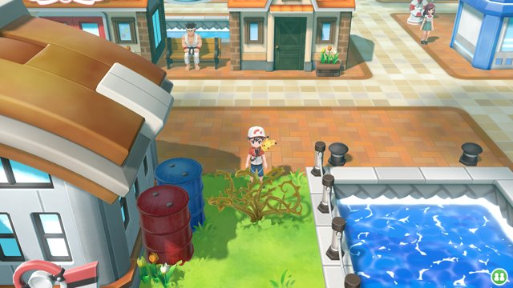</td>
<td>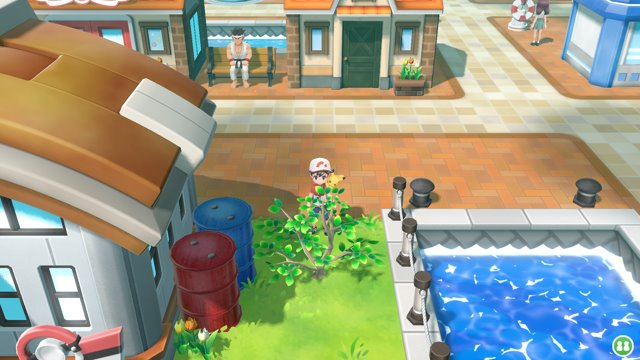</td>
</tr>
</table>

It turns out that a cuttable plant is visible in each of these screenshots.
Instead of being a small, leafy tree like in the original, the mainland Chinese version replaces it with what appears to be a dead, thorny plant.

Like many countries, the Chinese government regulates cutting down trees in an effort to prevent deforestation.
By replacing the mostly harmless tree with a plant that has dangerous thorns, this justifies the player's actions in cutting it down to get through.
Likewise, the fact that it is not a tree means that it would not be protected by these forestry laws.

<table>
<tr>
<th>Context</th>
<th>China</th>
<th>International</th>
</tr>
<tr>
<td>Secret Technique: Chop Down</td>
<td lang="zh-cmn-Hans"> "袈裟劈"</td>
<td> "袈裟斩"</td>
</tr>
</table>

The Secret Technique Chop Down is also renamed from 袈裟斩 <i>Jiāshāzhǎn</i> to 袈裟劈 <i>Jiāshāpī</i>. While 斩 <i>zhǎn</i> and 劈 <i>pī</i> can both mean "chop", 斩 <i>zhǎn</i> can also mean "behead".

## Gotta catch 'em all
<table>
<tr>
<th>Context</th>
<th>China</th>
<th>International</th>
</tr>
<tr>
<td>Wild encounter: Nice Throw</td>
<td lang="zh-cmn-Hans"> "漂亮一投!"</td>
<td> "Nice!"</td>
</tr>
<tr>
<td>Wild encounter: Great Throw</td>
<td lang="zh-cmn-Hans">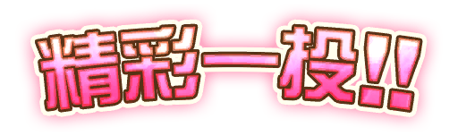 "精彩一投!!"</td>
<td> "Great!!"</td>
</tr>
<tr>
<td>Wild encounter: Excellent Throw</td>
<td lang="zh-cmn-Hans">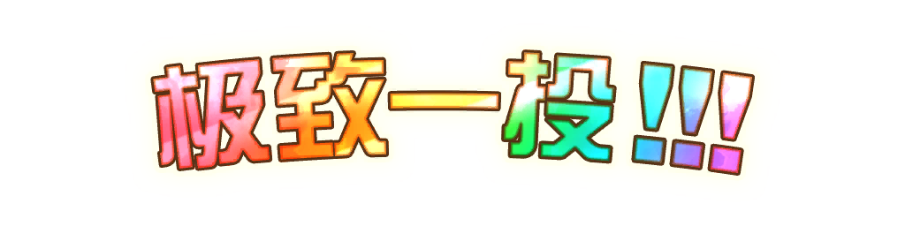 "极致一投!!!"</td>
<td> "Excellent!!!"</td>
</tr>
</table>

Like in Pokémon GO, making a Nice, Great, or Excellent Throw causes the corresponding text to be displayed. Even in the international Japanese and Chinese versions, this text is still written in English, as it's typically acceptable to leave terms like these untranslated in video games.

For the mainland Chinese version, these graphics are replaced with ones localized to simplified Chinese.

<table>
<tr>
<th>Context</th>
<th>China</th>
<th>International</th>
</tr>
<tr>
<td>When a Pokémon levels up
<td lang="zh-cmn-Hans"> "等级提升!"</td>
<td> "Level Up!"</td>
</tr>
</table>

When a Pokémon levels up, this message is displayed. Like with the throws, this is replaced with one in Chinese.

## Size matters
<table>
<tr>
<th>Context</th>
<th>China</th>
<th>International</th>
</tr>
<tr>
<td>Wild encounter: "It's huge!"</td>
<td lang="zh-cmn-Hans"> "大!"</td>
<td> "BIG!"</td>
</tr>
<tr>
<td>Wild encounter: "It's tiny!"</td>
<td lang="zh-cmn-Hans"> "小!"</td>
<td> "SMALL!"</td>
</tr>
</table>

Like in Pokémon GO, encountering a particularly large or small Pokémon causes some text to be displayed. In the international Japanese and Chinese versions, this text is still written in English, though in Japanese it's subtitled with おおきい <i>ōki</i> and ちいさい <i>chiisai</i>.

For the mainland Chinese version, these graphics are replaced with ones localized to simplified Chinese. While the international version used two fonts of different weights for each graphic, it seems like whoever put together the mainland Chinese graphic didn't notice, and used the same font for both. (This is most noticeable with the exclamation marks.)

<table>
<tr>
<th>Context</th>
<th>China</th>
<th>International</th>
</tr>
<tr>
<td>Summary screen: extra small
<td lang="zh-cmn-Hans"> "特小"</td>
<td> "XS"</td>
</tr>
<tr>
<td>Summary screen: small
<td lang="zh-cmn-Hans"> "小"</td>
<td> "S"</td>
</tr>
<tr>
<td>Summary screen: large
<td lang="zh-cmn-Hans"> "大"</td>
<td> "L"</td>
</tr>
<tr>
<td>Summary screen: extra large
<td lang="zh-cmn-Hans"> "特大"</td>
<td> "XL"</td>
</tr>
</table>

These graphics are used on a Pokémon's summary screen to describe its size. The English-language abbreviations are replaced with their Chinese equivalents.

## Time for battle
<table>
<tr>
<th>Context</th>
<th>China</th>
<th>International</th>
</tr>
<tr>
<td>Link Battle: VS</td>
<td lang="zh-cmn-Hans"> "对"</td>
<td> "VS"</td>
</tr>
<tr>
<td>Link Battle: Win</td>
<td lang="zh-cmn-Hans"> "胜利"</td>
<td> "WIN"</td>
</tr>
<tr>
<td>Link Battle: Lose</td>
<td lang="zh-cmn-Hans"> "败北"</td>
<td> "LOSE"</td>
</tr>
<tr>
<td>Link Battle: Draw</td>
<td lang="zh-cmn-Hans"> "平局"</td>
<td> "DRAW"</td>
</tr>
<tr>
<td>Link Battle: Match Time</td>
<td lang="zh-cmn-Hans"> "总时间"</td>
<td> "TOTAL TIME"</td>
</tr>
<tr>
<td>Link Battle: Move Time</td>
<td lang="zh-cmn-Hans"> "操作时间"</td>
<td> "COMMAND"</td>
</tr>
<tr>
<td>Battle: Info</td>
<td lang="zh-cmn-Hans"> "信息"</td>
<td> "Info"</td>
</tr>
</table>

These graphics featuring English text are used in battle, and were replaced with their Chinese equivalents. Note that although the "FIGHT", "POKÉMON", and "BAG" options in Trainer battles have English labels, it seems that since they were also labeled in Chinese, they did not need to be changed.

## Acronyms and abbreviations
<table>
<tr>
<th>Context</th>
<th>China</th>
<th>International</th>
</tr>
<tr>
<td>Summary screen: CP</td>
<td lang="zh-cmn-Hans"> "战力"</td>
<td> "CP"</td>
</tr>
<tr>
<td>Summary screen: HP</td>
<td lang="zh-cmn-Hans"> "体力"</td>
<td> "HP"</td>
</tr>
<tr>
<td>Wild encounter: Level</td>
<td lang="zh-cmn-Hans"> "等级"</td>
<td> "Lv."</td>
</tr>
<tr>
<td>Partner Play: 1P</td>
<td lang="zh-cmn-Hans"> "玩家1"</td>
<td> "1P"</td>
</tr>
<tr>
<td>Partner Play: 2P</td>
<td lang="zh-cmn-Hans"> "玩家2"</td>
<td> "2P"</td>
</tr>
</table>

These abbreviations are used in the Japanese, English, and Chinese localizations in the international version. As these also stand for English words, they are changed to their Chinese equivalents.

This also affects other in-game text that contains these phrases, as well as other abbreviations such as:
- "PP" → 回数 <i>Huíshù</i>
- "ID No." → 识别码 <i>Shìbiémǎ</i>
- "No." → 编号 <i>Biānhào</i>
- "m" → 米 <i>mǐ</i>
- "kg" → 千克 <i>qiānkè</i>
- "BGM" → 背景音乐 <i>Bèijǐng Yīnyuè</i>
- "SE" → 音效 <i>Yīnxiào</i>

The following moves, Abilities, and items were also affected by the removal of Latin letters:
<table>
<tr>
<th>English</th>
<th>Simplified Chinese (China)</th>
<th>Simplified Chinese (International)</th>
</tr>

<tr><th colspan="3">Moves</th></tr>
<tr><td>V-create</td><td lang="zh-cmn-Hans">胜利热焰</td><td lang="zh-cmn-Hans">Ｖ热焰</td></tr>
<tr><td>Darkest Lariat</td><td lang="zh-cmn-Hans">黑黑金勾臂</td><td lang="zh-cmn-Hans">DD金勾臂</td></tr>

<tr><th colspan="3">Abilities</th></tr>
<tr><td>RKS System</td><td lang="zh-cmn-Hans">阿尔宙斯系统</td><td lang="zh-cmn-Hans">AR系统</td></tr>

<tr><th colspan="3">Items</th></tr>
<tr><td>Ether</td><td lang="zh-cmn-Hans">回数单项小补剂</td><td lang="zh-cmn-Hans">PP单项小补剂</td></tr>
<tr><td>Max Ether</td><td lang="zh-cmn-Hans">回数单项全补剂</td><td lang="zh-cmn-Hans">PP单项全补剂</td></tr>
<tr><td>Elixir</td><td lang="zh-cmn-Hans">回数多项小补剂</td><td lang="zh-cmn-Hans">PP多项小补剂</td></tr>
<tr><td>Max Elixir</td><td lang="zh-cmn-Hans">回数多项全补剂</td><td lang="zh-cmn-Hans">PP多项全补剂</td></tr>
<tr><td>HP Up</td><td lang="zh-cmn-Hans">体力增强剂</td><td lang="zh-cmn-Hans">HP增强剂</td></tr>
<tr><td>PP Up</td><td lang="zh-cmn-Hans">回数提升剂</td><td lang="zh-cmn-Hans">PP提升剂</td></tr>
<tr><td>PP Max</td><td lang="zh-cmn-Hans">回数极限提升剂</td><td lang="zh-cmn-Hans">PP极限提升剂</td></tr>
<tr><td>Roto HP Restore</td><td lang="zh-cmn-Hans">体力回复碰碰</td><td lang="zh-cmn-Hans">HP回复碰碰</td></tr>
<tr><td>Roto PP Restore</td><td lang="zh-cmn-Hans">回数回复碰碰</td><td lang="zh-cmn-Hans">PP回复碰碰</td></tr>
<tr><td>Health Candy L</td><td lang="zh-cmn-Hans">元气糖果(大)</td><td lang="zh-cmn-Hans">元气糖果L</td></tr>
<tr><td>Mighty Candy L</td><td lang="zh-cmn-Hans">力量糖果(大)</td><td lang="zh-cmn-Hans">力量糖果L</td></tr>
<tr><td>Tough Candy L</td><td lang="zh-cmn-Hans">守护糖果(大)</td><td lang="zh-cmn-Hans">守护糖果L</td></tr>
<tr><td>Smart Candy L</td><td lang="zh-cmn-Hans">知识糖果(大)</td><td lang="zh-cmn-Hans">知识糖果L</td></tr>
<tr><td>Courage Candy L</td><td lang="zh-cmn-Hans">心灵糖果(大)</td><td lang="zh-cmn-Hans">心灵糖果L</td></tr>
<tr><td>Quick Candy L</td><td lang="zh-cmn-Hans">敏捷糖果(大)</td><td lang="zh-cmn-Hans">敏捷糖果L</td></tr>
<tr><td>Health Candy XL</td><td lang="zh-cmn-Hans">元气糖果(特大)</td><td lang="zh-cmn-Hans">元气糖果XL</td></tr>
<tr><td>Mighty Candy XL</td><td lang="zh-cmn-Hans">力量糖果(特大)</td><td lang="zh-cmn-Hans">力量糖果XL</td></tr>
<tr><td>Tough Candy XL</td><td lang="zh-cmn-Hans">守护糖果(特大)</td><td lang="zh-cmn-Hans">守护糖果XL</td></tr>
<tr><td>Smart Candy XL</td><td lang="zh-cmn-Hans">知识糖果(特大)</td><td lang="zh-cmn-Hans">知识糖果XL</td></tr>
<tr><td>Courage Candy XL</td><td lang="zh-cmn-Hans">心灵糖果(特大)</td><td lang="zh-cmn-Hans">心灵糖果XL</td></tr>
<tr><td>Quick Candy XL</td><td lang="zh-cmn-Hans">敏捷糖果(特大)</td><td lang="zh-cmn-Hans">敏捷糖果XL</td></tr>

<tr><th colspan="3">Clothing</th></tr>
<tr><td>Team Rocket Tee</td><td lang="zh-cmn-Hans">队服短袖</td><td lang="zh-cmn-Hans">火箭队Ｔ恤</td></tr>
<tr><td>Safari Tee</td><td lang="zh-cmn-Hans">狩猎短袖</td><td lang="zh-cmn-Hans">狩猎Ｔ恤</td></tr>
<tr><td>Sailor Tee</td><td lang="zh-cmn-Hans">水手短袖</td><td lang="zh-cmn-Hans">水手Ｔ恤</td></tr>
<tr><td>Formal Tee</td><td lang="zh-cmn-Hans">西服短袖</td><td lang="zh-cmn-Hans">西服Ｔ恤</td></tr>
<tr><td>Assistant Tee</td><td lang="zh-cmn-Hans">助手短袖</td><td lang="zh-cmn-Hans">助手Ｔ恤</td></tr>
<tr><td>Police Tee</td><td lang="zh-cmn-Hans">巡逻短袖</td><td lang="zh-cmn-Hans">警察Ｔ恤</td></tr>
<tr><td>Raichu Tee</td><td lang="zh-cmn-Hans">雷丘短袖</td><td lang="zh-cmn-Hans">雷丘Ｔ恤</td></tr>
<tr><td>Flareon Tee</td><td lang="zh-cmn-Hans">火伊布短袖</td><td lang="zh-cmn-Hans">火伊布Ｔ恤</td></tr>
<tr><td>Umbreon Tee</td><td lang="zh-cmn-Hans">月亮伊布短袖</td><td lang="zh-cmn-Hans">月亮伊布Ｔ恤</td></tr>
<tr><td>Leafeon Tee</td><td lang="zh-cmn-Hans">叶伊布短袖</td><td lang="zh-cmn-Hans">叶伊布Ｔ恤</td></tr>
<tr><td>Sylveon Tee</td><td lang="zh-cmn-Hans">仙子伊布短袖</td><td lang="zh-cmn-Hans">仙子伊布Ｔ恤</td></tr>
<tr><td>Glaceon Tee</td><td lang="zh-cmn-Hans">冰伊布短袖</td><td lang="zh-cmn-Hans">冰伊布Ｔ恤</td></tr>
<tr><td>Espeon Tee</td><td lang="zh-cmn-Hans">太阳伊布短袖</td><td lang="zh-cmn-Hans">太阳伊布Ｔ恤</td></tr>
<tr><td>Vaporeon Tee</td><td lang="zh-cmn-Hans">水伊布短袖</td><td lang="zh-cmn-Hans">水伊布Ｔ恤</td></tr>
<tr><td>Jolteon Tee</td><td lang="zh-cmn-Hans">雷伊布短袖</td><td lang="zh-cmn-Hans">雷伊布Ｔ恤</td></tr>
<tr><td>Blast-Off Tee</td><td lang="zh-cmn-Hans">感觉好好短袖</td><td lang="zh-cmn-Hans">感觉好好Ｔ恤</td></tr>

<tr><th colspan="3">Pokédex category</th></tr>
<tr><td>DNA Pokémon</td><td lang="zh-cmn-Hans">基因宝可梦</td><td lang="zh-cmn-Hans">DNA宝可梦</td></tr>
</table>

## Let the credits roll
<table>
<tr>
<th>China</th>
<th>International</th>
</tr>
<tr>
<td>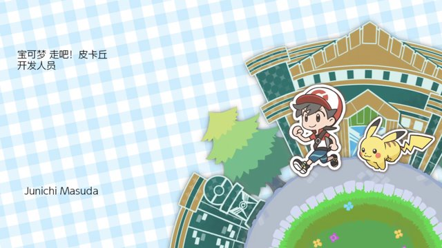</td>
<td></td>
</tr>
</table>

In the Pokémon games, the credits are generally written in English outside of Japan.
The game title is translated into Chinese, and "DEVELOPMENT STAFF" is translated as 开发人员 <i>Kāifā Rényuán</i>.
Unlike in *New Pokémon Snap*, which translated the role titles into Chinese, it appears GAME FREAK decided to remove them instead.

<table>
<tr>
<th>China</th>
<th>International</th>
</tr>
<tr>
<td></td>
<td></td>
</tr>
<tr>
<td></td>
<td></td>
</tr>
</table>

Here, you can see how the companies that worked on the game were marked with 开发公司 <i>kāifā gōngsī</i> (development company).
This was probably done as a workaround to allow these names to be kept in English;
New Pokémon Snap probably wrote redundant credits like 音响制作：HALF HP STUDIO（音响制作公司） <i>Yīnxiǎng Zhìzuò: HALF HP STUDIO (yīnxiǎng zhìzuò gōngsī)</i> "Sound Production: HALF HP STUDIO (sound production company)" for similar reasons.

For reference, the mainland dub of *Pokémon Journeys* actually went so far as to translate "HALF H·P STUDIO" as 半马力工作室 <i>Bàn Mǎlì Gōngzuòshì</i> (Half Horsepower Studio), and "OLM Team Kato" as 东方光魔加藤工作室 <i>Dōngfāng Guāngmó Jiāténg Gōngzuòshì</i> (Oriental Light and Magic, Kato Studio); so it's not without precendent for companies whose names are normally written in the Latin alphabet to use Chinese names in mainland China.

<table>
<tr>
<th>China</th>
<th>International</th>
</tr>
<tr>
<td></td>
<td></td>
</tr>
<tr>
<td></td>
<td></td>
</tr>
</table>

Besides Game Freak, these were the only two credited entities that were actually translated into Chinese:
- NOE Communications Coordination Group (任天堂欧洲联络统筹集团)
- Product Testing Technicians (产品测试技术员)

These are part of Nintendo of Europe and Nintendo of America, respectively, so it's possible that they'd already been translated for another Nintendo game previously.

<table>
<tr>
<th>China</th>
<th>International</th>
</tr>
<tr>
<td></td>
<td></td>
</tr>
<tr>
<td></td>
<td></td>
</tr>
<tr>
<td></td>
<td></td>
</tr>
</table>
<table>
<tr>
<th>Context</th>
<th>Simplified Chinese</th>
<th>English</th>
</tr>
<tr>
<td>Copyright notice</td>
<td lang="zh-cmn-Hans">
任天堂株式会社、株式会社宝可梦 
及游戏狂想家股份有限公司 
为此软件之著作权人，版权所有。</td>
<td>
Nintendo, The Pokémon Company and 
GAME FREAK inc. are the authors of 
this software for the purpose of copyright. 
All rights reserved.</td>
</tr>
</table>

The copyright date here and on the title screen is changed from 2018 to 2021.
In addition to the English and French copyright notices, a Chinese one is added.

<table>
<tr>
<th>Context</th>
<th>China</th>
<th>International</th>
</tr>
<tr>
<td>"THE END"</td>
<td lang="zh-cmn-Hans"> "完"</td>
<td> "THE END"</td>
</tr>
</table>

The "THE END" screen after the credits is also translated into Chinese.

## Sensitive words
There are several changes to move, Ability, and item names that we already saw starting in the international versions of Pokémon Brilliant Diamond and Shining Pearl.
It's probable that most of the work that was done on LGPE for China was already finished by the time BDSP came out.
None of these changes are included below, and I'll instead focus on changes that haven't been seen in the international versions.

### Trainer types
The names of the following types of Trainers were changed:
- <b>Burglar</b> 
  International: 趁火打劫者 <i>Chènhuǒ Dǎjiézhě</i> (Post-Fire Burglar) 
  China: 乘虚而入者 <i>Chéngxū'érrùzhě</i> (Intruder)
- <b>Gamer</b> 
  International: 赌徒 <i>Dǔtú</i> (Gambler) 
  China: 胜负师 <i>Shèngfù Shī</i> (Win-Lose Master)

Theft and gambling are clearly antisocial behaviors,
so they're renamed to be less explicit about what they're doing.
勝負師 <i>Shōbushi</i> can mean "gambler", "(professional) player (of shōgi, chess, etc.)", or "risk taker" in Japanese,
but it's not normally used with that idiomatic meaning in Chinese.

### Clothing
In addition to the ones listed earlier, the names of the following items of clothing were changed:
<table>
<tr>
<th>English</th>
<th>Simplified Chinese (China)</th>
<th>Simplified Chinese (International)</th>
</tr>
<tr><td>Team Rocket Cap</td><td lang="zh-cmn-Hans">队服帽</td><td lang="zh-cmn-Hans">火箭队帽</td></tr>
<tr><td>Team Rocket Top</td><td lang="zh-cmn-Hans">队服上装</td><td lang="zh-cmn-Hans">火箭队上装</td></tr>
<tr><td>Team Rocket Shorts</td><td lang="zh-cmn-Hans">队服裤</td><td lang="zh-cmn-Hans">火箭队裤</td></tr>
<tr><td>Team Rocket Shoes</td><td lang="zh-cmn-Hans">队服鞋</td><td lang="zh-cmn-Hans">火箭队鞋</td></tr>
<tr><td>Team Rocket Bag</td><td lang="zh-cmn-Hans">队服背包</td><td lang="zh-cmn-Hans">火箭队背包</td></tr>
<tr><td>Team Rocket Cap</td><td lang="zh-cmn-Hans">队服帽</td><td lang="zh-cmn-Hans">火箭队帽</td></tr>
<tr><td>Team Rocket Tee</td><td lang="zh-cmn-Hans">队服短袖</td><td lang="zh-cmn-Hans">火箭队Ｔ恤</td></tr>
<tr><td>Police Cap</td><td lang="zh-cmn-Hans">巡逻帽</td><td lang="zh-cmn-Hans">警察帽</td></tr>
<tr><td>Police Top</td><td lang="zh-cmn-Hans">巡逻上装</td><td lang="zh-cmn-Hans">警察上装</td></tr>
<tr><td>Police Shorts</td><td lang="zh-cmn-Hans">巡逻裤</td><td lang="zh-cmn-Hans">警察裤</td></tr>
<tr><td>Police Shoes</td><td lang="zh-cmn-Hans">巡逻鞋</td><td lang="zh-cmn-Hans">警察鞋</td></tr>
<tr><td>Police Bag</td><td lang="zh-cmn-Hans">巡逻背包</td><td lang="zh-cmn-Hans">警察背包</td></tr>
<tr><td>Police Cap</td><td lang="zh-cmn-Hans">巡逻帽</td><td lang="zh-cmn-Hans">警察帽</td></tr>
<tr><td>Police Tee</td><td lang="zh-cmn-Hans">巡逻短袖</td><td lang="zh-cmn-Hans">警察Ｔ恤</td></tr>
</table>

These change:
- "Team Rocket" (火箭队) to "Team Uniform" (队服)
- "Police" (警察) to "Patrol" (巡逻)

This is presumably to avoid wording it in such a way that makes it seem like the player is becoming a member of a criminal organization, or impersonating a police officer.

### Pokédex entries
<table>
<tr>
<th>Pokémon</th>
<th>China</th>
<th>International</th>
<th>Change</th>
</tr>
<tr>
<td>Beedrill</td>
<td lang="zh-cmn-Hans">它会用双手和 尾部的３根毒针 反复<mark>攻击</mark>敌人。</td>
<td lang="zh-cmn-Hans">它会用双手和 尾部的３根毒针 反复<mark>刺伤</mark>敌人。</td>
<td>
刺伤 (stab) 　↓ 
攻击 (attack)
</td>
</tr>
<tr>
<td>Beedrill (Mega Beedrill)</td>
<td lang="zh-cmn-Hans">双脚也变化为毒针。 用手脚的针猛<mark>攻</mark>之后，以 尾部的毒针给出最后一击。</td>
<td lang="zh-cmn-Hans">双脚也变化为毒针。 用手脚的针猛<mark>刺</mark>之后，以 尾部的毒针给出最后一击。</td>
<td>
刺 (stab) 　↓ 
攻 (attack)
</td>
</tr>
<tr>
<td>Golbat</td>
<td lang="zh-cmn-Hans">难以察觉它会从哪里悄悄 接近。它会用尖锐的牙 咬住对手，同时<mark>削弱对手</mark>。</td>
<td lang="zh-cmn-Hans">难以察觉它会从哪里悄悄 接近。它会用尖锐的牙 咬住对手，同时<mark>使劲地吸血</mark>。</td>
<td>
使劲地吸血 (suck blood) 　↓ 
削弱对手 (weaken the opponent)
</td>
</tr>
<tr>
<td>Oddish</td>
<td lang="zh-cmn-Hans">要是以为它是普通的草而 将它拔起，就会听到它的叫声。 这让人莫名<mark>地</mark>感到<mark>害怕</mark>。</td>
<td lang="zh-cmn-Hans">要是以为它是普通的草而 将它拔起，就会听到它的叫声。 这让人感到莫名<mark>的恐怖</mark>。</td>
<td>
恐怖 (terrified) 　↓ 
害怕 (scared)
</td>
</tr>
<tr>
<td>Paras</td>
<td lang="zh-cmn-Hans">它会通过挖洞来从树根里 吸取营养，但大部分营养 都会被背上的蘑菇<mark>吸收</mark>。</td>
<td lang="zh-cmn-Hans">它会通过挖洞来从树根里 吸取营养，但大部分营养 都会被背上的蘑菇<mark>抢走</mark>。</td>
<td>
抢走 (take by force) 　↓ 
吸收 (absorb)
</td>
</tr>
<tr>
<td>Weepinbell</td>
<td lang="zh-cmn-Hans">它在肚子饿的时候会 吞掉周围会动的东西， 分泌溶解液<mark>将其消化</mark>。</td>
<td lang="zh-cmn-Hans">它在肚子饿的时候会 吞掉周围会动的东西， 分泌溶解液<mark>让其致命</mark>。</td>
<td>
让其致命 (makes it deadly) 　↓ 
将其消化 (to digest it)
</td>
</tr>
<tr>
<td>Victreebel</td>
<td lang="zh-cmn-Hans">用花蜜的香味引诱猎物。 据说被它吞入嘴里的东西， 只要1天就会<mark>消化殆尽</mark>。</td>
<td lang="zh-cmn-Hans">用花蜜的香味引诱猎物。 据说被它吞入嘴里的东西， 只要1天就会<mark>溶解到连骨头都不剩</mark>。</td>
<td>
溶解到连骨头都不剩 (dissolved, bones and all) 　↓ 
将其消化 (digested)
</td>
</tr>
<tr>
<td>Dodrio</td>
<td lang="zh-cmn-Hans">由嘟嘟的某个头<mark>分化</mark> 出的变种。以60千米的 时速在草原上奔跑。</td>
<td lang="zh-cmn-Hans">由嘟嘟的某个头<mark>分裂</mark> 出的变种。以60千米的 时速在草原上奔跑。</td>
<td>
分裂 (split apart) 　↓ 
分化 (diverged)
</td>
</tr>
<tr>
<td>Haunter</td>
<td lang="zh-cmn-Hans">被它舔到时生命力会被吸走， 身体会不受控制地不停颤抖， 最后<mark>失去意识</mark>。</td>
<td lang="zh-cmn-Hans">被它舔到时生命力会被吸走， 身体会不受控制地不停颤抖， 最后<mark>一命呜呼</mark>。</td>
<td>
一命呜呼 (drop dead) 　↓ 
失去意识 (lose consciousness)
</td>
</tr>
<tr>
<td>Gengar</td>
<td lang="zh-cmn-Hans">如果你突然感到寒气逼近， 就说明耿鬼在你身边，或许 它已经在你身上下了<mark>咒术</mark>。</td>
<td lang="zh-cmn-Hans">如果你突然感到寒气逼近， 就说明耿鬼在你身边，或许 它已经在你身上下了<mark>诅咒</mark>。</td>
<td>
诅咒 (curse) 　↓ 
咒术 (spell)
</td>
</tr>
<tr>
<td>Voltorb</td>
<td lang="zh-cmn-Hans">据说它与精灵球相似的外形 其实是它的保护色，但它 很容易<mark>迸裂</mark>这一点也出人意料。</td>
<td lang="zh-cmn-Hans">据说它与精灵球相似的外形 其实是它的保护色，但它 很容易<mark>自爆</mark>这一点也出人意料。</td>
<td>
自爆 (self-detonate) 　↓ 
迸裂 (burst open)
</td>
</tr>
<tr>
<td>Cubone</td>
<td lang="zh-cmn-Hans">头上戴着母亲<mark>留下的遗物</mark>。 它的哭声会在<mark>其中</mark> 回响出悲伤的旋律。</td>
<td lang="zh-cmn-Hans"><mark>它</mark>头上戴着<mark>死去</mark>母亲<mark>的头骨</mark>。 它的哭声会在<mark>头骨里</mark> 回响出悲伤的旋律。</td>
<td>
死去母亲的头骨 (skull of its dead mother) 　↓ 
母亲留下的遗物 (relics left behind by its mother)
</td>
</tr>
<tr>
<td>Marowak (Alola Form)</td>
<td lang="zh-cmn-Hans">今晚也<mark>会用 逝去</mark>母亲的灵魂<mark>之焰</mark> 跳起吊慰伙伴的舞蹈。</td>
<td lang="zh-cmn-Hans"><mark>把死别</mark>母亲的灵魂 <mark>变为火焰</mark>，今晚也<mark>将</mark> 跳起吊慰伙伴的舞蹈。</td>
<td>
把死别 (parted by death), 变为 (transformed into) 　↓ 
逝去 (passed away), 之 (of)
</td>
</tr>
<tr>
<td>Hitmonlee</td>
<td lang="zh-cmn-Hans">在踢中<mark>目标</mark>的瞬间， 脚底会变得像钻石般坚硬， 将<mark>目标踢得粉碎</mark>。</td>
<td lang="zh-cmn-Hans">在踢中<mark>敌人</mark>的瞬间， 脚底会变得像钻石般坚硬， 将<mark>对手踢成碎片</mark>。</td>
<td>
敌人 (foe), 碎片 (shatter, fragment) 　↓ 
目标 (target), 粉碎 (pulverize, defeat)
</td>
</tr>
<tr>
<td>Scyther</td>
<td lang="zh-cmn-Hans">突然从草丛里窜出来， <mark>挥舞着锋利镰刀</mark>的 样子仿佛就像是忍者。</td>
<td lang="zh-cmn-Hans">突然从草丛里窜出来， <mark>用锋利的镰刀斩砍</mark>的 样子仿佛就像是忍者。</td>
<td>
用锋利的镰刀斩砍 (slices with its scythes) 　↓ 
挥舞着锋利镰刀 (brandishes its scythes)
</td>
</tr>
<tr>
<td>Gyarados</td>
<td lang="zh-cmn-Hans">性格蛮横喜欢破坏。在古代， 这个<mark>可怕</mark>的宝可梦曾经有过 把整座城市<mark>毁坏</mark>的记录。</td>
<td lang="zh-cmn-Hans">性格蛮横喜欢破坏。在古代， 这个<mark>恐怖</mark>的宝可梦曾经有过 把整座城市<mark>烧成焦土</mark>的记录。</td>
<td>
恐怖 (terrifying), 烧成焦土 (burn to the ground) 　↓ 
可怕 (scary), 毁坏 (destroy)
</td>
</tr>
<tr>
<td>Omastar</td>
<td lang="zh-cmn-Hans">它拥有锋利的牙齿，但 据说它由于外壳过大， 不易移动而导致<mark>绝迹</mark>。</td>
<td lang="zh-cmn-Hans">它拥有锋利的牙齿，但 据说它由于外壳过大， 不易移动而导致<mark>灭绝</mark>。</td>
<td>
灭绝 (extinct) 　↓ 
絕跡 (disappear)
</td>
</tr>
<tr>
<td>Kabutops</td>
<td lang="zh-cmn-Hans">用纤细的身体快速游动。 似乎会用镰刀<mark>捕猎， 然后</mark>吸取<mark>营养</mark>。</td>
<td lang="zh-cmn-Hans">用纤细的身体快速 游动。似乎会用镰刀 <mark>撕裂猎物</mark>吸取<mark>体液</mark>。</td>
<td>
撕裂猎物 (slice its prey), 体液 (body fluids) 　↓ 
捕猎 (catch its prey), 营养 (nutrients)
</td>
</tr>
</table>

These changes primarily reword text to tone down the violence and mentions of death and bones.

### Miscellaneous
- The word 中央 <i>zhōngyāng</i> (central) is replaced with 中心 <i>zhōngxīn</i> (center). 中央 <i>Zhōngyāng</i> can also refer to the <a href="https://en.wikipedia.org/wiki/Central_Committee_of_the_Chinese_Communist_Party" rel="noopener noreferrer">Central Committee of the Chinese Communist Party</a>, so that would explain why it was changed.
- The phrase for "one-hit knockout", 一击必杀 <i>yījībìshā</i> (one-hit kill), is replaced with 一击终结 <i>yījī zhōngjié</i> (one-hit finish).

## Further reading
There are some other minor text changes that generally fall into the same vein as the changes I've already described;
you can find these on <a href="https://abcboy101.github.io/poke-corpus/#query=WHERE+zh-Hans+%21%3D+zh-Hans-CN&type=boolean&collections=LetsGoPikachuLetsGoEevee&languages=zh-Hans%2Czh-Hans-CN">Poké Corpus</a>, or by checking out the <a href="https://bulbapedia.bulbagarden.net/wiki/User:Abcboy#Text_dumps" rel="noopener noreferrer">text dumps</a> yourself.

Special thanks to 果冻 for making this possible.
