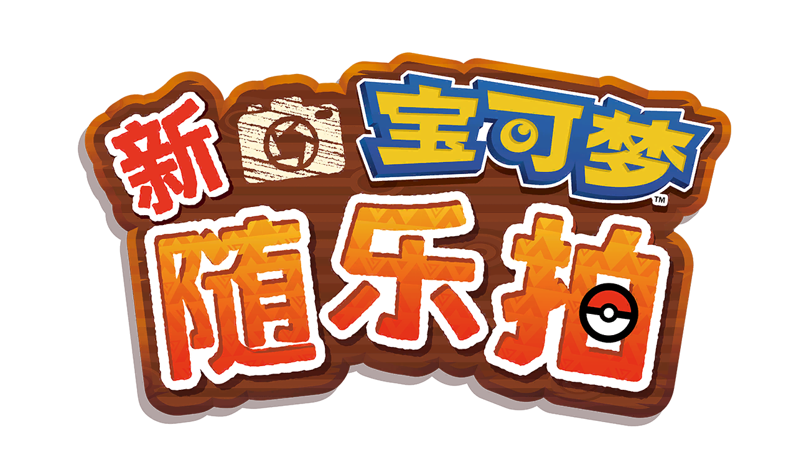
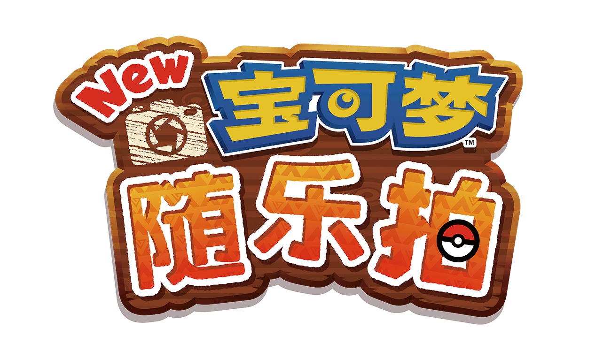
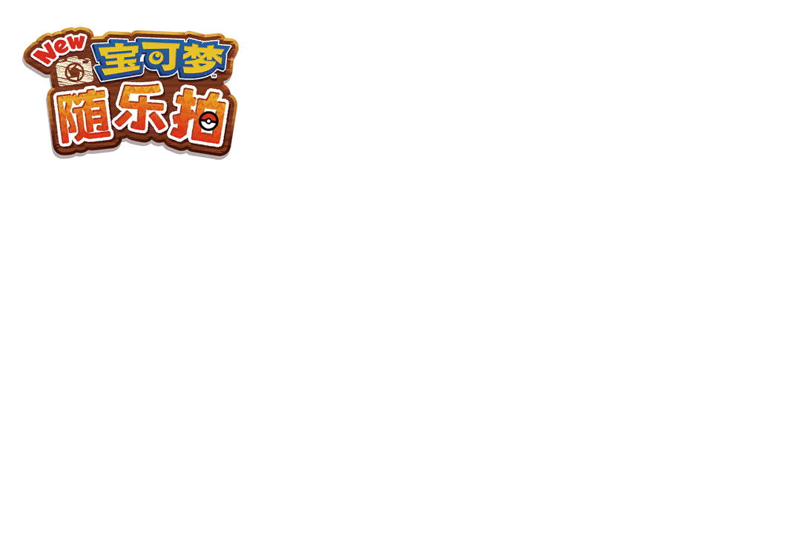
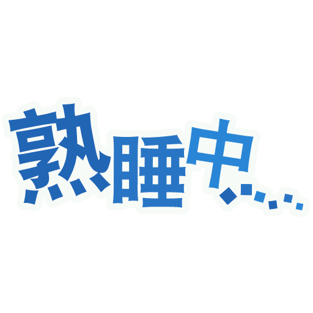
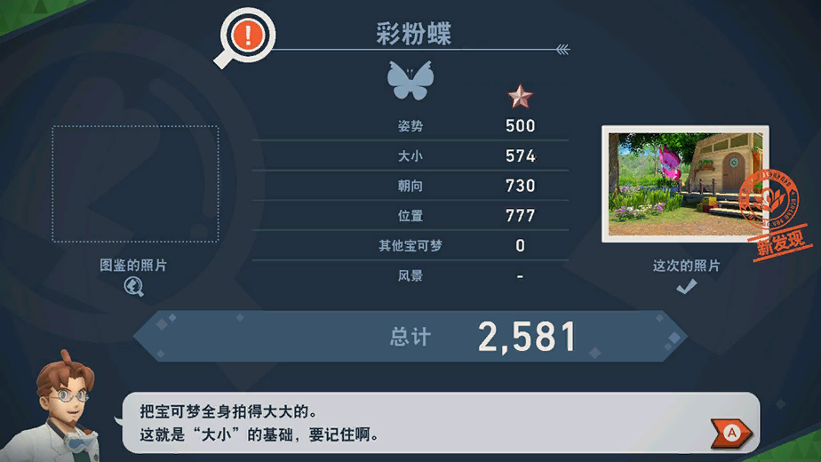
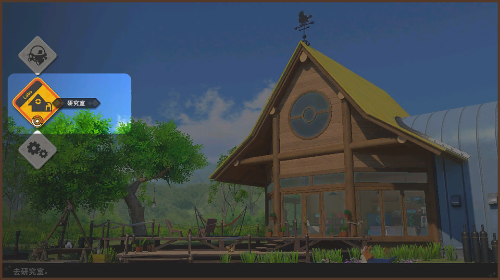
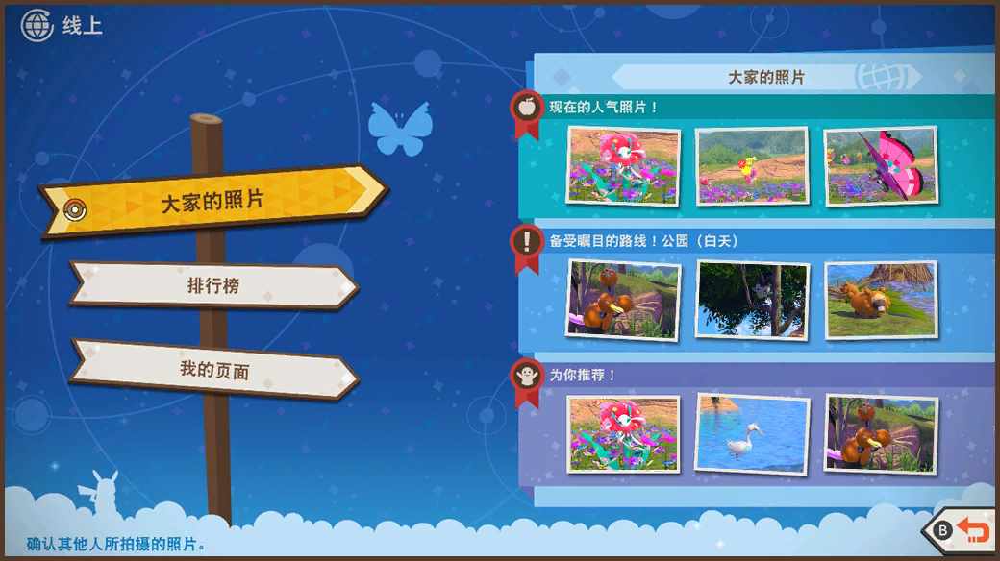
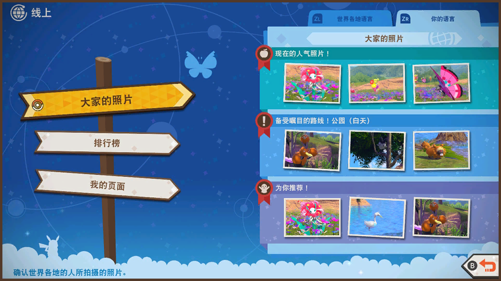

# New Pokémon Snap
In mainland China, the <a href="https://www.nppa.gov.cn_" rel="noopener noreferrer">National Press and Publication Administration</a> (国家新闻出版署) approves all video games for release, regardless of whether it was developed domestically or internationally.
New Pokémon Snap was <a href="https://www.nppa.gov.cn_bsfw/jggs/yxspjg/jkwlyxspxx/202402/t20240202_831561.html" rel="noopener noreferrer">approved for release</a> on February 1, 2024, and was released for the Nintendo Switch on July 16 that year.

## Game title and logo
<table style="text-align: center">
<tr>
<th>Context</th>
<th>China</th>
<th>International</th>
</tr>
<tr>
<td>Game logo</td>
<td></td>
<td></td>
</tr>
<tr>
<td>Frame 38</td>
<td></td>
<td></td>
</tr>
<tr>
<td>Frame 42</td>
<td></td>
<td></td>
</tr>
<tr>
<td>Text</td>
<td lang="zh-cmn-Hans">"新宝可梦随乐拍"</td>
<td lang="zh-cmn-Hans">"New 宝可梦随乐拍"</td>
</tr>
</table>

English words, especially those code-mixed with Chinese, are not allowed.
This notably affects the title of the game, which swaps the English word "new" for the Chinese word for "new", <i>xīn</i> (新).
This also affects the photo frames that include the game's logo.

## The global lingua franca
<table style="text-align: center">
<tr>
<th>China</th>
<th>International</th>
</tr>
<tr>
<td lang="zh-cmn-Hans"> 新发现</td>
<td> NEW</td>
</tr>
<tr>
<td lang="zh-cmn-Hans"> 赞！</td>
<td> Good!</td>
</tr>
<tr>
<td lang="zh-cmn-Hans"> 最高</td>
<td> MAX</td>
</tr>
</table>

In many older video games, memory limitations necessitated them to use only a small amount of memory, so they often couldn't support languages with more characters like Chinese, Japanese, or Korean. Because of this, they were often written in English and left in English when exported to other regions.

Since it's typically acceptable to leave some terms untranslated in video games in these languages, these graphics all use English text in every language in the international version of the game.
However, for the mainland Chinese version, these graphics are replaced with ones localized to simplified Chinese.
(Since the game's language select has been removed, it makes no difference whether this would affect other language versions.)

## Untranslatable onomatopoeia
<table style="text-align: center">
<tr>
<th>Context</th>
<th>China</th>
<th>International</th>
</tr>
<tr>
<td>Sticker</td>
<td></td>
<td></td>
</tr>
<tr>
<td>Text</td>
<td lang="zh-cmn-Hans">"熟睡中……"</td>
<td>"Zzz..."</td>
</tr>
</table>

This sticker features the letters "zzz," which are often used to represent the sound of snoring or sleeping in English.
This is replaced with <i>Shúshuì zhōng...</i> (熟睡中……) which means "In deep sleep..."

## The sun, it burns
<table style="text-align: center">
<tr>
<th>Context</th>
<th>China</th>
<th>International</th>
</tr>
<tr>
<td>Sticker</td>
<td></td>
<td></td>
</tr>
<tr>
<td>Time of day marker</td>
<td></td>
<td></td>
</tr>
<tr>
<td>Profile icon</td>
<td></td>
<td></td>
</tr>
</table>
The sticker, time of day marker, and profile icon featuring the sun are changed from having triangular rays to having dots or rectangles instead.
For those unfamiliar, the <a href="https://en.wikipedia.org/wiki/Blue_Sky_with_a_White_Sun" rel="noopener noreferrer">Blue Sky with a White Sun</a> (青天白日), a white circle surrounded by 12 triangles on a blue circle, is a symbol often associated with <a href="https://en.wikipedia.org/wiki/Taiwan" rel="noopener noreferrer">Taiwan, the Republic of China</a>, and the <a href="https://en.wikipedia.org/wiki/Kuomintang">Kuomintang (Chinese Nationalist Party)</a>.
Because of this, these depictions of the sun have been changed to ones that less closely resemble the Blue Sky with a White Sun emblem.

## Knock-on effects
<table style="text-align: center">
<tr>
<th>Context</th>
<th>China</th>
<th>International</th>
</tr>
<tr>
<td>Evaluation</td>
<td></td>
<td></td>
</tr>
<tr>
<td>Menu</td>
<td></td>
<td></td>
</tr>
<tr>
<td>Photodex</td>
<td></td>
<td></td>
</tr>
<tr>
<td>Online</td>
<td></td>
<td></td>
</tr>
</table>
These screenshots are used during in-game tutorials.
Because of the changes I've covered above, as well as others I haven't mentioned yet, these screenshots had to be updated to match.
I'll describe the differences for each in turn:

- The "NEW" stamp has been changed out. The photo that was taken on the Vivillon itself is also different.
- The decorative text is changed from "Labo" to "研究室" (Laboratory), matching the plain text on the label.
- Several pieces of English text were removed: "No.", and the the SI symbols for meters ("m"), and kilograms ("kg").
  These were translated as their Chinese equivalents "编号" (number), "米千" (meters), "克" (kilograms).
  They haven't had to do this previously on the TCG cards, so we'll have to see whether this will carry over to the main games.
- The international version has two online rankings: "All Languages" and "Your Language".
  Since the mainland Chinese version doesn't communicate online with the international version, the "All Languages" option is removed.

## Photodex entries
<table>
<tr>
<th>Pokémon</th>
<th>China</th>
<th>International</th>
<th>Changes</th>
</tr>
<tr>
<td>Seviper 饭匙蛇</td>
<td lang="zh-cmn-Hans">
或许是因为饭匙蛇性格一丝不苟， 
所以它经常在打磨尾巴上的刀刃吧。 
它的刀刃不但锋利， 
还会<mark>分泌毒液。</mark></td>
<td lang="zh-cmn-Hans">
或许是因为饭匙蛇性格一丝不苟， 
所以它经常在打磨尾巴上的刀刃吧。 
它的刀刃不但锋利， 
还会<mark>渗出剧毒，极其危险。</mark></td>
<td>Remove "剧毒" (highly toxic)</td>
</tr>
<tr>
<td>Koffing 瓦斯弹</td>
<td lang="zh-cmn-Hans">
身体里充满了带毒的瓦斯。 
它之所以有时会胀得很大， 
是因为毒沼泽的成分 
促进了化学变化。</td>
<td lang="zh-cmn-Hans">
身体里充满了带<mark>有剧</mark>毒的瓦斯。 
它之所以有时会胀得很大， 
是因为毒沼泽的成分 
促进了化学变化。</td>
<td>Remove "剧毒" (highly toxic)</td>
</tr>
<tr>
<td>Houndoom 黑鲁加</td>
<td lang="zh-cmn-Hans">
黑鲁加会采取群体行动， 
通过默契配合守护遗迹。 
它们长嚎的声音很<mark>可怕</mark>， 
被人们称为“<mark>深渊</mark>之声”。</td>
<td lang="zh-cmn-Hans">
黑鲁加会采取群体行动， 
通过默契配合守护遗迹。 
它们长嚎的声音很<mark>恐怖</mark>， 
被人们称为“<mark>地狱</mark>之声”。</td>
<td>Remove "恐怖" (terror), "地狱" (hell) 
Replace with "可怕" (scary), "深渊" (abyss)</td>
</tr>
<tr>
<td>Crabominable 好胜毛蟹</td>
<td lang="zh-cmn-Hans">
凡事不经过大脑， 
先把拳头挥出去再说。 
<mark>战斗到白热化</mark>时， 
能发挥出巨大的力量。</td>
<td lang="zh-cmn-Hans">
凡事不经过大脑， 
先把拳头挥出去再说。 
<mark>打架打得起劲</mark>时， 
能发挥出巨大的力量。</td>
<td>Replace "打架打得起劲" (fight vigorously) Replace with "打架打得起劲" (battle reaches its climax)</td>
</tr>
</table>

## Further reading
Due to its much later release date, the copyright date is changed from 2021 to 2023.

There are some other minor changes that mostly fall into the category of removing English text; you can find these by checking out the <a href="https://bulbapedia.bulbagarden.net/wiki/User:Abcboy#Text_dumps" rel="noopener noreferrer">text dumps</a> yourself.
